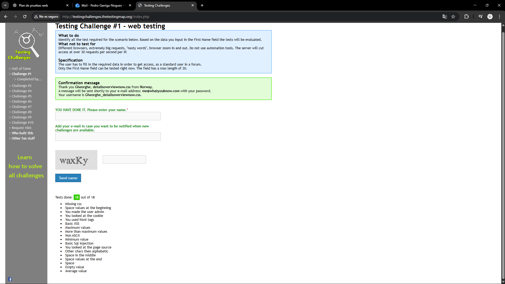

Web Testing Challenge #1 — Test plan, techniques and reflections

Intro:
The purpose of this repository is to do two tests, the first one is a test challenge that consists in testing in first solving a testing exercise in a webpage called [testingchallemges-](http://testingchallenges.thetestingmap.org/index.php) and the second is doing an API test calling to an endpoint via cypress.

I'll be showing the answers to the first in the rest of this readme.md and the API endpoint test will be in the other files.

Testing Challenge #1 - web testing:

1. Answers:

Image with the screenshot: 

2. Techniques used:

Initially doing the "usual" basic tests like inserting empty or only numerical characters and got 10 answers.

After seeing this wasn't getting me far, I tried chatgpt, that gave 18 solutions, but after trying to replicate them I found out 7 where wrong. 

Then I started googling for answers and found out many people saying that you had to open the devtools and play around, that's when I started figuring out the rest.

3. What I've found interesting:

Honestly, playing with the devtools for so long, since I asumed in this kind of login test that the main thing that matters is the inputs, and also it kinda has expanded the inputs I use to play with, for instance, I'm not used to add a test with Html tags to it to my login tests, so it kinda shows there's always room to improve even the basic stuff you've done 100 times.
